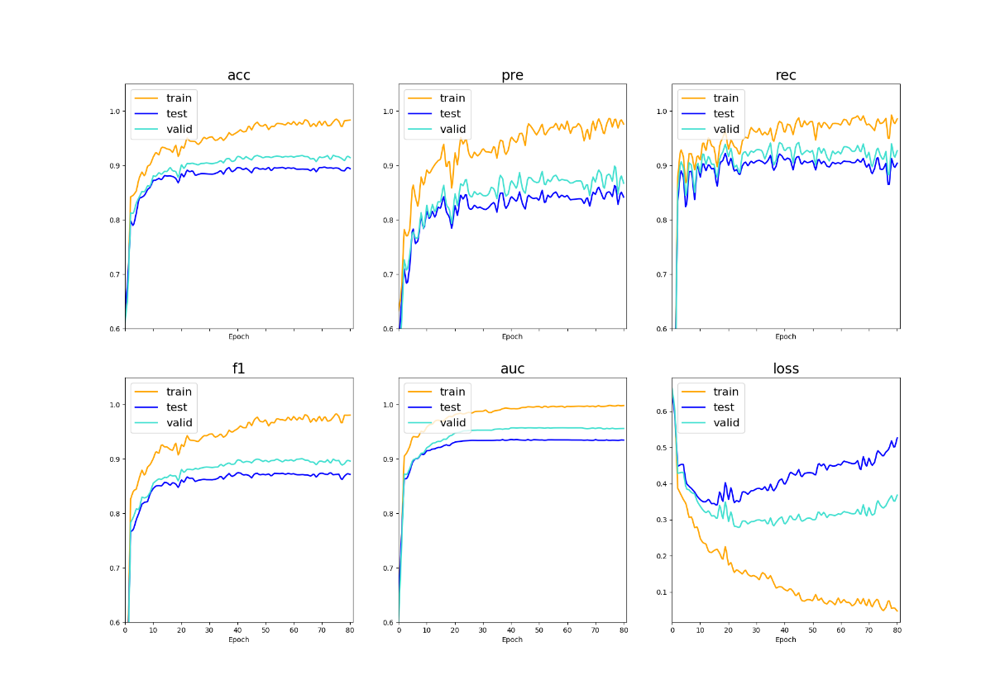

# Multimodal-Emotion-Analysis-Algorithm-Combining-Text-and-Images
multimodal-sarcasm-detection

**[介绍](./README.md)**

**[Introduction ](./README_EN.md)**

****
## Catalogue
* [Foreword](#Foreword)
* [效果图](#效果图)
* [FileStructure](#FileStructure)
* [LibrariesAndVersions](#LibrariesAndVersions)
* [TheModelArchitecture](#TheModelArchitecture)
* [简单的介绍](#简单的介绍)
   * [项目背景](#项目背景)
   * [参数设置](#参数设置)
   * [数据增强](#数据增强)

## Foreword
This project was improved under the premise of reproducing the paper, the address of the original paper：https://aclanthology.org/P19-1239/

Performance：acc:0.917, pre:0.871, rec:0.930, **f1:0.900**, acu:0.956, loss:0.3920
Better than the original paper

## 效果图


## FileStructure
```
.
│  ReadMe.md 
├─codes - Main Running folder
│  │  ImageFeature.py      - Networks that process features of pictures
│  │  ExtractFeature.py    - Networks that deal with category features
│  │  TextFeature.py       - Networks that process text features
│  │  NNManager.py         - Total network framework
│  │  Main.py              - main
│  │  Attention.py         - Attention mechanism
│  │  Function.py          - Static functions and variables
│  │  ImageRegionNet.py    - Generate image vectors
│  │  MyDataSet.py         - Constructing the dataset
│  │  ResNet.py            - ResNet
│  │  DATASET.py           - Enumeration
│  │  DataAugment.py       - Data augmentation
│  │  废弃代码.py
│  │  
│  ├─ablation - Ablation experiment
│  │      DeleteEFNet.py   - Delete early fusion
│  │      DeleteRFNet.py   - Delete representation fusion
│  │      ReplaceEFNet.py  - Image features were used for early fusion
│  │      
│  ├─modelCompare - Comparison of models
│  │      BiLSTMBert.py    - Text features only
│  │ 
├─image - 
│  ├─imageDataSet          - Original image
│  ├─augmentImages         - Image after data augmentation
│  └─imageVector           - Image vector
|
├─class
│     classGloveVector.npy - Pre-trained Glove vectors 
│     classVocab.py3       - Category vocabulary
│     image2class.py3      - augmentImages+imageDataSet Corresponding category
│     image2classBefore.py3- imageDataSet Corresponding category
|
├─text
│     textGloveVector.npy  - Pre-trained Glove vectors 
│     textVocab.py3        - Words vocabulary
│     text.txt             - Text
│     train_text           - Train set 0.8
│     test_text            - Test set 0.1
│     valid_text           - Valid set 0.1
|
├─modelWeights - Pre-trained model parameters
│  │  resnet50.pth         - # https://download.pytorch.org/models/
│  │  
│  └─bert-base-cased       - # https://huggingface.co/bert-base-cased
│          
└─outputs 
   └─****-**-**
      │  ****-**-**.pth    - Model parameters
      │  describe.txt      - logs
      │  logs.py3          - trian test valid lr 
      |    
      └─runs               - TensorBoard   1. cd The current folder 2. tensorboard --logdir=runs 3. Open the URL
```
## LibrariesAndVersions
Win10 + Anaconda
|     Name     |   Version   |
| :----------: | :---------: |
|    python    |    3.8.0    |
|   pytorch    | 1.8.1+cu111 |
|  matplotlib  |    3.4.2    |
| scikit-learn |    1.2.2    |
| transformers |   4.29.1    |
|    pillow    |    9.5.0    |

```
pip install ***==**** -i https://pypi.tuna.tsinghua.edu.cn/simple/
```

## TheModelArchitecture


## 简单的介绍
### 项目背景


　　本项目是本人的本科论文的源代码，由于论文写的太烂，这里就不献丑了。本项目的就是基于图像和文本在前人[Cai等人](https://aclanthology.org/P19-1239/)的基础上，进行反讽检测，在实现中，我改变的他的网络结构，加入了注意力机制进行融合，提高了些精度，收敛效果也是不错的。如果源码有什么错误或者更好的实现，欢迎交流。真诚的感谢原论文的作者们才能让我完成了这个项目，他们也提交了原论文的代码，[start一下](https://github.com/headacheboy/data-of-multimodal-sarcasm-detection)。

### 参数设置
　　这些参数是我手调的，一定还有比这个更好的，还请提醒一下，感谢
|       **Hyper-parameters**        | **Values** |
| :-------------------------------: | :--------: |
|           Learning rate           |    1e-4    |
|            Batch size             |    128     |
|             Norm type             |     2      |
|         Gradient Clipping         |     10     |
|              Dropout              |    0.1     |
|         LSTM hidden size          |    256     |
|          LSTM num layers          |     2      |
| Word and attribute embedding size |    200     |
|           Sequence len            |     80     |
|          ResNet FC size           |    1024    |
|       Modality fusion size        |    512     |

### 数据增强
　　基于[MixGen](https://arxiv.org/abs/2206.08358)算法多模态的数据增强方法,公式如下：

$$ I_{new}=\varphi\bullet I_{base}+\left(1-\varphi\right)\bullet I_{insert} $$

$$ T_new=RandomInsert(T_insert,T_base,\varphi) $$

　　其中，φ为保留I_base  or T_base的比例，在本任务中φ≥0.7，以保证语义关系是匹配的。效果：


